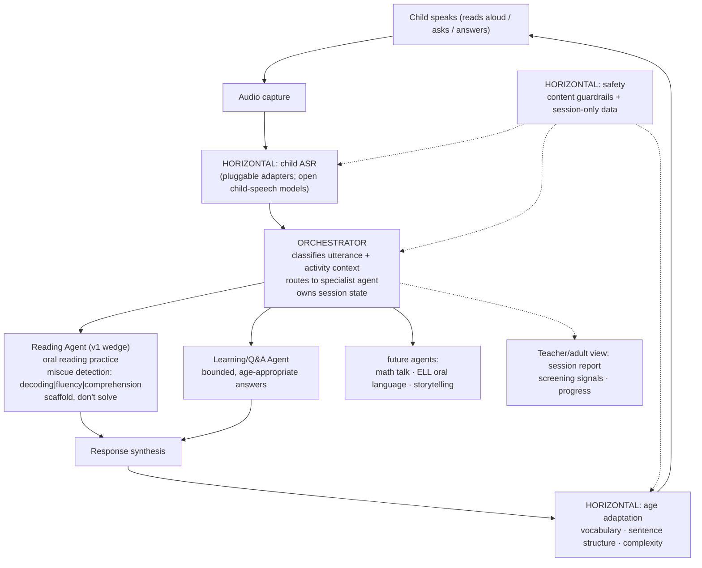

# learnling

An open-source, voice-first learning agent — it listens while a learner
reads aloud and helps in the moment.

Built for early readers **and for older students reading below grade
level**. Skill level and content level are tracked separately, so a
twelve-year-old practising decoding gets age-appropriate material, not
material written for a six-year-old.

*-ling* as in duckling: a young learner, at whatever age the learning
happens.

## The problem

Chatbot-style AI tutoring assumes a child can already articulate what they
don't know and ask a good question about it. That's a metacognitive skill —
knowing what you don't know, and being able to put it into words — and it's
exactly the skill learning is supposed to build in the first place. Young
children mostly don't have it yet. That's a big part of why "ask me
anything" chat tutors have underperformed for this age group: the child has
to clear a hurdle just to start the interaction.

**The thesis:** embed the AI in the activity instead of waiting beside it.
The child reads aloud, or talks through a task, the way they already would
with a teacher or parent nearby. The agent listens, understands the
utterance at the child's developmental level, and responds inside the flow
of the activity — no separate chat window, no need to first figure out what
to ask. Engagement is structural to the task, not optional.

## Why now

Child speech recognition has historically been far worse than adult ASR —
word error rates 4-8x higher are typical for generic models, because almost
all training data skews adult. That's been the practical blocker for
anything voice-first aimed at young children. It's starting to change: open
child-speech-recognition efforts are cutting those error rates
substantially and publishing open weights as a public good. What's still
missing is the layer on top — an agent that's safe, age-adaptive, and
actually built for the learner in front of it rather than a
chat-completion adult. That's learnling.

## Skill level and content level are not the same thing

Most reading tools collapse these into a single "reading level", and that
one decision is why so little intervention software survives past third
grade. An eleven-year-old working on consonant digraphs needs digraph
practice — but hand them *the cat sat on the mat* and they learn something
else instead: that the tool thinks they are a baby. Then they stop using
it, and no amount of correct instruction matters.

learnling tracks two independent axes, and never derives one from the
other:

| | |
|---|---|
| `foundational_stage` | phonics, decoding, fluency, word recognition |
| `comprehension_stage` | vocabulary, inference, text structure, analysis |
| `content_tier` | themes, topics, lexicon — **from age, never from skill** |

The two skill tracks move independently, so a learner can be
`foundational_stage="2"`, `comprehension_stage="5"`, `content_tier=UPPER`:
an older student with a decoding gap and strong comprehension. That is the
normal case this is designed around, not an edge case.

Content tiers are `EARLY` (4–7), `MIDDLE` (8–11) and `UPPER` (12+).
Choosing a passage is an intersection of all three properties — patterns
from the decoding stage, theme and lexicon from the tier, prompts from the
comprehension stage — and a learner is **never** served material below
their age tier. Serving above it is fine, with scaffolding.

Four rules follow from this and are enforced in code, not convention:

- Content tier never reads a skill field. It is a read-only property over a
  function that takes an age and nothing else.
- Struggle earns more scaffolding at the current stage first. Only an
  exhausted ladder steps a single sub-skill back, and never the whole track.
- No stage change from a single session — three sessions of consistent
  evidence are required. Fatigue, mood and an unfamiliar topic all look
  exactly like a skill gap in one sitting.
- No demotion language ever reaches the learner. Step-backs happen, and are
  named by skill ("let's practise breaking big words apart"), never by
  grade, level or difficulty.

## Fluency, measured against published norms

learnling reports oral reading fluency as **words correct per minute
(WCPM)** against the Hasbrouck & Tindal ORF norms — the instrument
intervention teachers already use. An educator can interpret the output on
sight, with no explanation and no need to trust a scale we invented. An
invented scale means nothing to anyone.

> Hasbrouck, J. & Tindal, G. (2017). *An update to compiled ORF norms*
> (Technical Report No. 1702). Eugene, OR: Behavioral Research and
> Teaching, University of Oregon.

```
wcpm = (total words read − uncorrected errors) / elapsed minutes
```

**Counted as errors:** mispronunciations, substitutions, omissions,
hesitations beyond about three seconds, and words supplied by the system.

**Not errors:** self-corrections, repetitions, insertions, variation
attributable to accent or dialect, and proper nouns on first encounter.
That last group matters more than it looks — counting a dialect variation
as an error tells a child their own speech is wrong, which is both false
and a reliable way to lose them.

Results are banded against the grade level of the **passage**, never the
learner's own grade, so a twelve-year-old reading grade-2 material is
measured against grade-2 norms. `needs_fluency_support` implements
Hasbrouck & Tindal's published guidance exactly: ten or more words below
the 50th percentile, averaged over **two unpracticed readings**. With fewer
readings on record it withholds the judgment and says why, because one
reading measures a day rather than a reader.

Three rules govern how any of this is shown:

- **Never show a percentile to a learner.** Bands are for the educator
  report. To the learner: growth over time, never rank.
- **Never celebrate speed.** A child who learns that reading should be fast
  concludes they are bad at it the moment it isn't.
- **Always report accuracy alongside rate.** High rate with low accuracy is
  not fluency, and rate alone hides exactly the reader who is guessing
  their way through a page at speed.

## A note on ASR precision

Child speech recognition still misrecognises correct productions. learnling
therefore biases miscue detection toward **not** flagging — high precision
over high recall — and drops candidate miscues below a configurable
confidence threshold (`MISCUE_CONFIDENCE_THRESHOLD`, or the
`LEARNLING_MISCUE_CONFIDENCE` environment variable).

This is a deliberate design decision rather than a tuning default, because
the two failure modes do not cost the same thing. A missed error costs one
coaching opportunity out of many, and the next read will surface it again.
A false *"you got that wrong"* costs a child confidence in their own
reading and their trust in the tool — and no later correction takes that
back. Given an asymmetry that steep, the detector should stay quiet when it
is unsure.

A suppressed miscue does not count against the learner's accuracy either;
scoring them down for something we declined to raise would be the same
accusation made quietly. The educator report shows how often the system
stayed silent, so an adult can see it happening.

## Architecture

Orchestrator on top; specialist agents per application; horizontal layers
(ASR, age adaptation, safety) shared by all of them. Adding a new
application means adding a new agent — the layers underneath don't change.



## Design principles

1. **In the flow of the activity** — feedback happens inside the task
   (reading aloud), not in a separate chat.
2. **Scaffold, don't solve** — guide the child toward the answer; never
   just hand it over.
3. **Age-adaptive by construction** — vocabulary, sentence structure, and
   complexity of every response match the learner's developmental age.
   Skill level and content level are tracked separately, so practising an
   early skill never means being handed material written for a younger
   child.
4. **Safety as architecture** — content moderation and privacy-preserving
   data handling wrap every layer; they are not bolt-ons. No voice
   retention beyond the session by default. Designed with COPPA
   constraints in mind.
5. **Open** — open code, open design, built on open models.

## Quickstart

```bash
git clone https://github.com/dhruvbhatnagar7/learnling.git
cd learnling
pip install -e .

python -m learnling demo
```

`demo` runs a scripted session end-to-end with no setup — a child reading a
passage with a small miscue, a clean re-read, and a spoken question — so
you can see the whole loop in about 10 seconds.

Try it with your own input:

```bash
python -m learnling read --passage passages/sample_level1.txt --age 6 \
    --simulate "the cat sat on teh mat"

python -m learnling ask --age 7 --simulate "why is the sky blue"
```

Real audio input (`--audio recording.wav`) requires the `asr` extra:
`pip install "learnling[asr]"`. An optional LLM-backed Q&A and adaptation
polish pass is available via the `llm` extra
(`pip install "learnling[llm]"`) — see `learnling/agents/learning.py` and
`learnling/adaptation.py` for how to enable it.

## Safety & privacy

Safety and privacy are architectural constraints applied to every response,
not a feature bolted on afterward:

- No audio is ever written to disk by this package.
- Transcripts live only in an in-memory session for the duration of the
  process — nothing persists unless you explicitly ask for a report.
- `--save-report` writes session **stats** (accuracy, words-per-minute,
  miscue counts, assessment categories) — not raw transcripts — by default.
- No personal information is requested or stored; the agent redirects if
  asked to solicit it.
- Every response, whether rule-based or LLM-backed, passes through a
  content guardrail before it reaches the child.

See [`SAFETY.md`](SAFETY.md) for the full policy, including COPPA-informed
design notes.

## Roadmap

- [x] **M1 — Text-simulated reading loop:** orchestrator + reading agent +
      age adaptation + safety + CLI demo.
- [x] **M1.5 — Skill/content separation and published fluency norms:** two
      independent skill tracks, age-derived content tiers, passage selection
      as an intersection, WCPM against Hasbrouck & Tindal, confidence-gated
      miscue detection.
- [ ] **M2 — Real audio:** whisper adapter; word timestamps → real fluency
      metrics, and per-word confidence feeding the miscue gate.
- [ ] **M3 — Open child-ASR models:** adapters for open child-speech
      models (word + phoneme tracks) as open weights publish;
      phoneme-level decoding feedback.
- [ ] **M4 — Comprehension dialogue:** post-reading spoken Q&A
      (LLM-backed), comprehension assessment beyond heuristics.
- [ ] **M5 — Screening report:** longitudinal per-child signals suitable
      for a teacher/parent view.
- [ ] Later: math-talk agent, ELL oral-language agent, storytelling agent.

## Status

Early design / v0 — the reading loop works in text-simulation mode; audio
and open child-ASR adapters are on the roadmap. Contributions and issues
welcome.

## License

Apache-2.0
