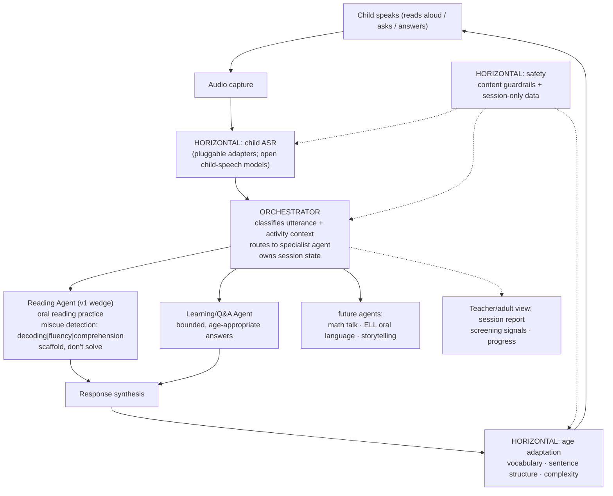

# learnling

An open-source, voice-first learning agent for young children — it listens
while they read and helps in the moment.

*-ling* as in duckling: a young learner.

## The problem

Chatbot-style AI tutoring assumes a child can already articulate what they
don't know and ask a good question about it. That's a metacognitive skill —
knowing what you don't know, and being able to put it into words — and it's
exactly the skill learning is supposed to build in the first place. Young
children mostly don't have it yet. That's a big part of why "ask me
anything" chat tutors have underperformed for this age group: the child has
to clear a hurdle just to start the interaction.

**The thesis:** embed the AI in the activity instead of waiting beside it.
The child reads aloud, or talks through a task, the way they already would
with a teacher or parent nearby. The agent listens, understands the
utterance at the child's developmental level, and responds inside the flow
of the activity — no separate chat window, no need to first figure out what
to ask. Engagement is structural to the task, not optional.

## Why now

Child speech recognition has historically been far worse than adult ASR —
word error rates 4-8x higher are typical for generic models, because almost
all training data skews adult. That's been the practical blocker for
anything voice-first aimed at young children. It's starting to change: open
child-speech-recognition efforts are cutting those error rates
substantially and publishing open weights as a public good. What's still
missing is the layer on top — an agent that's safe, age-adaptive, and
actually built for a 6-year-old rather than a chat-completion adult. That's
learnling.

## Architecture

Orchestrator on top; specialist agents per application; horizontal layers
(ASR, age adaptation, safety) shared by all of them. Adding a new
application means adding a new agent — the layers underneath don't change.



## Design principles

1. **In the flow of the activity** — feedback happens inside the task
   (reading aloud), not in a separate chat.
2. **Scaffold, don't solve** — guide the child toward the answer; never
   just hand it over.
3. **Age-adaptive by construction** — vocabulary, sentence structure, and
   complexity of every response match the child's developmental age.
4. **Safety as architecture** — content moderation and privacy-preserving
   data handling wrap every layer; they are not bolt-ons. No voice
   retention beyond the session by default. Designed with COPPA
   constraints in mind.
5. **Open** — open code, open design, built on open models.

## Quickstart

```bash
git clone https://github.com/dhruvbhatnagar7/learnling.git
cd learnling
pip install -e .

python -m learnling demo
```

`demo` runs a scripted session end-to-end with no setup — a child reading a
passage with a small miscue, a clean re-read, and a spoken question — so
you can see the whole loop in about 10 seconds.

Try it with your own input:

```bash
python -m learnling read --passage passages/sample_level1.txt --age 6 \
    --simulate "the cat sat on teh mat"

python -m learnling ask --age 7 --simulate "why is the sky blue"
```

Real audio input (`--audio recording.wav`) requires the `asr` extra:
`pip install "learnling[asr]"`. An optional LLM-backed Q&A and adaptation
polish pass is available via the `llm` extra
(`pip install "learnling[llm]"`) — see `learnling/agents/learning.py` and
`learnling/adaptation.py` for how to enable it.

## Safety & privacy

Safety and privacy are architectural constraints applied to every response,
not a feature bolted on afterward:

- No audio is ever written to disk by this package.
- Transcripts live only in an in-memory session for the duration of the
  process — nothing persists unless you explicitly ask for a report.
- `--save-report` writes session **stats** (accuracy, words-per-minute,
  miscue counts, assessment categories) — not raw transcripts — by default.
- No personal information is requested or stored; the agent redirects if
  asked to solicit it.
- Every response, whether rule-based or LLM-backed, passes through a
  content guardrail before it reaches the child.

See [`SAFETY.md`](SAFETY.md) for the full policy, including COPPA-informed
design notes.

## Roadmap

- [x] **M1 — Text-simulated reading loop:** orchestrator + reading agent +
      age adaptation + safety + CLI demo (this build).
- [ ] **M2 — Real audio:** whisper adapter; word timestamps → real fluency
      metrics.
- [ ] **M3 — Open child-ASR models:** adapters for open child-speech
      models (word + phoneme tracks) as open weights publish;
      phoneme-level decoding feedback.
- [ ] **M4 — Comprehension dialogue:** post-reading spoken Q&A
      (LLM-backed), comprehension assessment beyond heuristics.
- [ ] **M5 — Screening report:** longitudinal per-child signals suitable
      for a teacher/parent view.
- [ ] Later: math-talk agent, ELL oral-language agent, storytelling agent.

## Status

Early design / v0 — the reading loop works in text-simulation mode; audio
and open child-ASR adapters are on the roadmap. Contributions and issues
welcome.

## License

Apache-2.0
