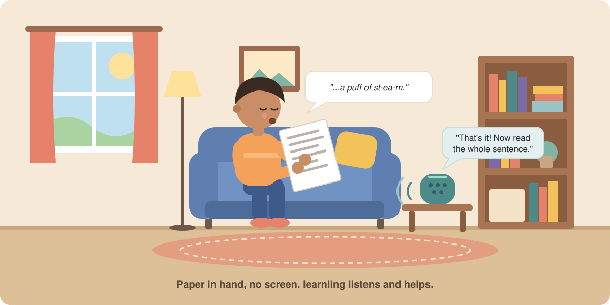
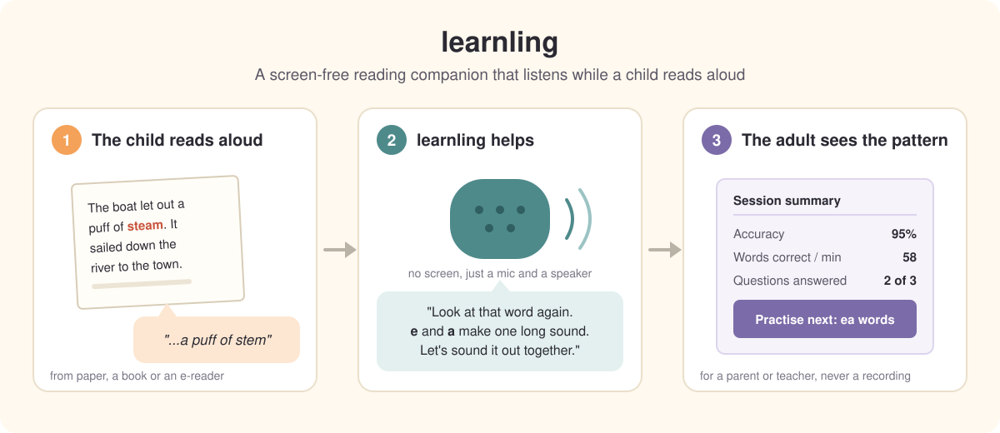
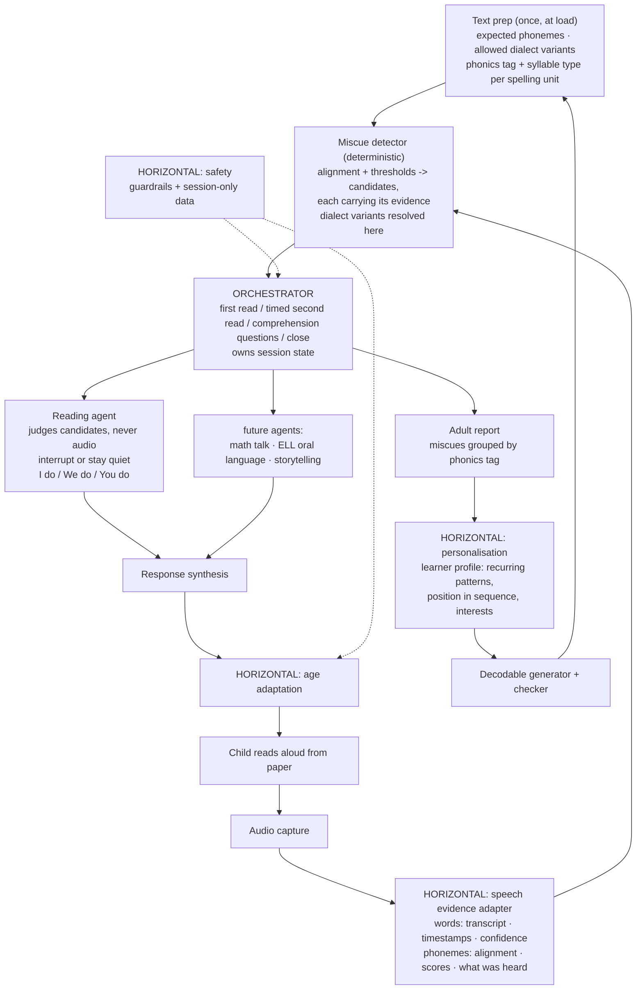

# learnling

[](https://github.com/dhruvbhatnagar7/learnling/actions/workflows/tests.yml)




**An open, screen-free reading companion for home.** It listens while a child reads aloud, helps in
the moment, and turns their mistakes into their next story.

- **What it is:** a voice-only agent that sits beside a child reading from paper, the way a parent or teacher would.
- **Who it's for:** children from age 4 up, including older students reading below grade level.
- **What it gives adults:** a short summary of where each child is stuck, added up across a class.
- **What works today:** the reading loop, in text simulation. [Try it in a minute](#quickstart).

*-ling* as in duckling: a young learner, at whatever age the learning happens.



## Contents

- [The problem](#the-problem)
- [A reading session, step by step](#a-reading-session-step-by-step)
- [Where the text comes from](#where-the-text-comes-from)
- [Skill level and content level](#skill-level-and-content-level)
- [Limitations: recognising children's speech](#limitations-recognising-childrens-speech)
- [The speech evidence interface](#the-speech-evidence-interface)
- [Architecture](#architecture)
- [Design principles](#design-principles)
- [What this isn't](#what-this-isnt)
- [Prior art](#prior-art)
- [Quickstart](#quickstart)
- [Safety and privacy](#safety-and-privacy)
- [Roadmap](#roadmap)
- [Contributing](#contributing)

---

## The problem

**Chat tutors expect a child to know what to ask. Young children mostly can't yet.** learnling puts
the help inside something the child already does, reading aloud, so there's no app to open and
nothing to ask for.

| The gap | The evidence |
|---|---|
| **Reading is slipping** | 40% of US fourth graders scored below Basic in 2024, up from 37% in 2022 ([NAEP 2024](https://www.nationsreportcard.gov/reports/reading/2024/g4_8/)). |
| **Reading for fun is falling** | Nine-year-olds reading for fun almost daily fell from 53% (2012) to 39% (2022). |
| **Adults are stretched** | A teacher can't listen to each child read, and many parents aren't sure how to help with a stuck word. |
| **Homework is invisible** | The only record of nightly reading is usually a parent's signature. |

A useful tool here has to do three things:

1. Make reading enjoyable again for children who have stopped wanting to do it.
2. Notice when a reading child is stuck, and help in the moment.
3. Tell the teacher where each child is weak, and add it up across the class.

<details>
<summary><b>Read more:</b> why chat tutors struggle with young children, and the full reading figures</summary>

Chat-style AI tutoring asks a child to work out what they don't understand and then put it into a
question. That's a hard skill, and it's the one that learning is supposed to build. Most young
children don't have it yet, which is a good part of why "ask me anything" tutors have done badly with
this age group. The child has to get over a hurdle before anything starts.

The alternative is to put a proactive agent inside something the child is already doing. Reading
aloud works well for this use case. A child reads the way they would with an adult sitting next to
them, and the agent listens and helps as they go.

Children are still asked to read every day, but they are reading less well and less often than they
used to. On the 2024 National Assessment of Educational Progress, 40% of fourth graders scored below
the Basic level in reading, up from 37% in 2022. About a third of eighth graders scored below Basic,
the largest share since the assessment began in 1992
([NAEP 2024 reading](https://www.nationsreportcard.gov/reports/reading/2024/g4_8/)).

Reading for fun has fallen as well. In 2012, 53% of nine-year-olds said they read for fun almost
every day, and by 2022 that was 39%. For thirteen-year-olds it went from 27% in 2012 to 14% in 2023,
the lowest figure the survey has recorded
([NAEP long-term trend](https://www.nationsreportcard.gov/highlights/ltt/2023/),
[National Endowment for the Arts summary](https://www.arts.gov/stories/blog/2024/federal-data-reading-pleasure-all-signs-show-slump)).

The adults around the child are stretched. A teacher with a full class can't sit beside each child
and listen to them read. Many parents are working in the evening, or aren't sure how to help when
their child gets stuck on a word. Children who do read on their own tend to guess at or skip the
words they can't sound out, so the reading happens but the phonics practice doesn't.

Most schools send home something like twenty minutes of reading a night, and in most houses the only
record of it is a parent's signature.

</details>

## A reading session, step by step

*Target design.* learnling is designed to run on a small cloud-connected device with a
microphone, a speaker and no screen. The child reads from paper, a book or an e-reader. The device
already has the same text, so it knows which words are coming.

**Example** (names and details are made up): Sam is in second grade and his class is learning vowel
digraphs, like the *ea* in "steam". His teacher, Linda, assigned a passage about a steamboat, so the
device at home already has it.

| Step | What happens | What it's for |
|---|---|---|
| **1. First read** | Sam reads "a puff of steam" as "a puff of **stem**". The device waits, then reminds him *e* and *a* make one long sound. They sound it out together and Sam re-reads the whole sentence correctly. | Accuracy |
| **2. Second read** | Sam reads the passage again. No interruptions. The device times it. | Fluency (words correct per minute) |
| **3. Questions** | Three spoken questions. Two are answered in the text. One (why the captain turned back) needs Sam to work it out, so they talk it through. | Comprehension |
| **4. Feedback** | The device says what went well and names one thing to practise: *ea* words. | Encouragement |
| **5. Teacher summary** | Linda sees Sam missed 3 of 5 *ea* words, and that 8 of her 22 students had the same trouble. She spends ten minutes on it with the class. | Planning |
| **6. Next passage** | Sam's next passage has more *ea* words in it. | Personalisation |

> [!TIP]
> There's no timer, streak or badge. A session ends when the child reaches the end of the text, and
> what the adult sees is about the reading ("ea words keep tripping her up"), not whether homework
> got done.

<details>
<summary><b>Read more:</b> the rules behind each read</summary>

The first read is for accuracy. The agent keeps quiet while things are going fine, and waits a
moment before stepping in. When it is confident about a miscue it does what a reading teacher does:
sounds the word out with the child, then asks them to read the whole sentence again and get it
right. Fixing the word on its own isn't the point; the sentence has to come out clean. If sounding
it out together doesn't work, the agent just says the word and moves on.

The second read is the same passage again, now familiar, for fluency. No interruptions this time,
because stopping a child mid-sentence is not helpful. This is the read that produces words correct
per minute, reported against the Hasbrouck and Tindal (2017) norms.

Moving on to the next skill uses the published threshold too: 95-98% accuracy on a first attempt.

After the second read the agent asks a few spoken questions about the passage. Some can be answered
straight from the text and at least one needs the child to work something out. This means one
session covers accuracy, fluency and comprehension on the same passage. Comprehension is tracked
separately from decoding, because a child can be strong at one and weak at the other.

learnling doesn't keep a reading log. It doesn't count minutes or streaks, it doesn't tell the child
they missed yesterday, and it gives no badges for turning up.

</details>

## Where the text comes from

*Target design.* The device has to know the text before the child starts reading. It gets there
one of two ways.

| | Someone chose the text | The device writes the text |
|---|---|---|
| **When** | School assigned it, or the child picked a book | Nothing is assigned |
| **How it arrives** | Synced from school, or a parent photographs the page | A language model writes a decodable from the child's target patterns and interests |
| **Safeguard** | Words using untaught patterns are tagged; the agent just says them and they don't count as mistakes | A deterministic checker confirms every word uses taught patterns, or it's regenerated. The safety layer checks it too. |
| **How the child reads it** | Paper, book or e-reader | Printed at home, or in a weekly pack printed at school |

<details>
<summary><b>Read more:</b> photographed pages, decodables and the printing problem</summary>

**1. Someone chose the text.** It covers two situations. In the first, the school assigned the
reading and the assignment is already synced to the device through the cloud, so there is nothing
for the family to do. In the second, the child is reading something the device doesn't have, such
as a library book. The child or a parent takes a photo of the page with a phone and sends it to the
device, and the device converts the photo into text. The second situation matters because assigned
texts are mostly a K-2 thing. Most US reading homework is free choice, and a book the child picked
has no known text unless someone captures it.

Where a text is loaded either way, any words using patterns the child hasn't been taught get tagged
at load time. The agent just tells the child those words instead of running a correction on them,
and they don't count as mistakes.

**2. The device generates the text.** Here nobody has assigned anything, and the device writes a
passage for the child. The passage is a decodable, which is a short text written so that nearly
every word uses only the phonics patterns the child has already been taught. A language model writes
it using the child's target phonics patterns and their interests. A separate checker, deterministic
rather than another model, then confirms every word only uses patterns the child has already been
taught, or taught sight words. Language models are bad at hard constraints, so if the check fails
the passage gets regenerated rather than shipped. The safety layer runs over it as well, since it's
text a child is about to read.

Because the device has no screen, a generated passage has to end up on paper before the child can
read it. The intended path is that the device sends it straight to the printer in the house.

Printing can't be the only option, though. The families whose children need this most are the least
likely to have a printer at home. A weekly pack printed at school, or a cheap built-in printer, are
both worth designing for.

</details>

## Skill level and content level

**A ten-year-old working on second grade phonics should get passages about things ten-year-olds care
about, not a story written for six-year-olds.** So learnling tracks three things separately and never
derives one from another:

| Property | Covers | Set from |
|---|---|---|
| `foundational_stage` | phonics, decoding, fluency, word recognition | the child's reading |
| `comprehension_stage` | vocabulary, inference, text structure, analysis | the child's answers |
| `content_tier` | themes, topics, lexicon | **age only, never skill** |

Content tiers are `EARLY` (4-7), `MIDDLE` (8-11) and `UPPER` (12+). A passage is the intersection of
all three. A learner is never given material below their age tier. Above it is fine, with support.

**Four rules follow from this:**

1. **Topic depends only on age.** Reading skill never changes the subjects a child is given.
2. **More help comes before easier material.** If *ea* keeps tripping a child up, the agent helps more first, and only then steps back on *ea* alone.
3. **No stage change from one session.** It takes three sessions in a row showing the same thing.
4. **The child is never told they moved down.** Step-backs are named by skill ("let's practise breaking big words apart"), never by grade or level.

<details>
<summary><b>Read more:</b> where the idea comes from, personalisation, and the four rules in detail</summary>

A child can be in one place on decoding and somewhere else entirely on comprehension, and neither
follows from their age. Collapsing all of that into one "reading level" is why a lot of intervention
software stops working once a child is old enough to notice what they've been handed.

This idea isn't ours. High-interest low-readability publishing is built on it, structured literacy
for older readers has worked this way for decades. Some classroom tools already apply it too: a
teacher picks a skill, and the generated text is personalised to what the class is into.

learnling is designed to do the same thing for one child at home, and to cover both sides of reading
in the same session. The first side is fluency, which is whether the child can read the words
accurately and at a reasonable pace. The second is comprehension, which is whether they understood
what they read. The two are tracked separately.

**Personalisation.** Over many sessions the device is designed to learn three things about a child.
It learns where they usually trip up, such as a particular spelling pattern they keep missing. It
learns what they like and don't like to read, from which passages they finish and which they give up
on. And it learns what topics they like to talk about, from the conversation around the
comprehension questions. The words a child keeps missing decide which patterns go into their next
passage, and their interests decide what the passage is about. A passage about something the child
cares about is more relatable, and the aim is that they read more because of it.

What's different from the classroom tools is who picks the skill. Here nobody selects anything from
a menu. The child's own mistakes across sessions choose the patterns for their next passage, without
a teacher having to step in.

**The four rules, with examples.**

1. **What a passage is about depends only on the child's age.** A child's reading skill never
   changes the subjects and themes they are given. For example, a ten-year-old who is still working
   on second grade phonics gets passages about things ten-year-olds care about, written with simple
   spelling patterns. They are not given a story written for six-year-olds. In the code, the content
   tier is calculated from age and cannot be set from any skill field.

2. **When a child struggles, they get more help before they get easier material.** Suppose a child
   keeps missing *ea* words. The first thing that changes is the amount of help. The agent sounds
   out more of those words with the child, and the next passages have fewer *ea* words mixed in with
   words the child already reads well. The level of the material stays the same. If the child is
   still missing *ea* words after that, they go back to an easier step for *ea* only, such as
   practising it in single words before meeting it in sentences. Their other spelling patterns,
   their comprehension level and their topics do not change.

3. **A child's stage does not change after one session.** It changes when three sessions in a row
   show the same thing. A child can read badly on one evening because they are tired, upset, or
   reading about something they know nothing about, and in a single session that looks the same as
   a skill gap.

4. **The child is never told they have been moved down a level.** When the agent goes back to an
   easier step, it describes the skill, for example "let's practise breaking big words apart". It
   does not mention a grade or a level, and the child does not see their profile.

</details>

## Limitations: recognising children's speech

> [!WARNING]
> **Speech recognition is much worse on children than on adults, and knowing the text only partly
> fixes it.** A normal recogniser can only write down real words. If a child sounds out *steam* as
> "steh-am", the recogniser hears the closest real word, "steam", and the mistake disappears.

What this means in practice:

- **Caught by word-level recognition:** mistakes that are real words, like "stem" for "steam", and skipped words.
- **Missed by word-level recognition:** non-word attempts and half-finished sounding out, which is most of what a decoding child produces.
- **The fix:** a second model that listens for individual sounds (phonemes). These exist but are less accurate on children's voices.
- **What would help most:** recordings of children reading aloud, labelled sound by sound. Very little is public.

<details>
<summary><b>Read more:</b> why this happens, and how comprehension answers are handled</summary>

Speech recognition is much worse on children than on adults. Word error rates several times higher
are normal, because nearly all the training data is adult, and it gets worse the younger the child
is.

Reading aloud looks like it should be able to dodge this, and it partly does. You know the text in
advance, so the job is narrower: check what the child said against words and sounds you're already
expecting, rather than transcribe open speech (where the computer does not know what's coming next).
That's a much smaller problem.

It isn't a solved problem though, and the reason has to do with how speech recognition works. A
speech recogniser is the software that turns audio into written words. It is the same kind of
software that sits behind phone dictation and voice assistants. It has a vocabulary of real words,
and for each stretch of sound it picks the word from that vocabulary that fits best. It can only
answer with real words.

Now suppose the page says *steam*, and a child who hasn't learned that *ea* makes one sound reads the
two letters separately and says "steh-am". That isn't a word, so the recogniser can't write it down.
It picks the closest real word instead, which is probably "steam". The transcript now says the child
read "steam" correctly, when in fact they got it wrong.

That means word-level transcription only shows you miscues that happen to be real words, like "stem"
for "steam". Non-word attempts and half-finished sounding out, which is most of what a child who is
actually decoding produces, don't survive the trip. To catch those you need evidence about individual
sounds.

That evidence comes from a second kind of model, one that listens for individual sounds instead of
whole words. It would hear "steh-am", see that the sounds don't match *steam*, and flag it. The next
section describes how that works. These models exist, but they are less accurate on children's
voices than on adults', which is why this is listed as a limitation.

This matters because the whole experience depends on hearing the mistake. If the mistake has been
tidied away before the agent sees it, the agent stays quiet, the child gets no help on the word they
were struggling with, and the summary for the adult doesn't show it either. The children this happens
to most are the ones still learning to decode, who are the ones the tool is for.

So knowing the text makes the recognition problem smaller, but it doesn't make it go away.

**Comprehension answers.** The comprehension questions are a smaller version of this problem. The
device doesn't know in advance what a child will say in answer to a question. The way around it is
to ask questions that can be answered with yes or no, a single word or a short phrase, such as "the
storm". The device then only has to tell a handful of expected answers apart, which speech
recognition does well. The cost is that questions needing a longer explanation in the child's own
words are harder to check, so those are kept for the conversation and not scored.

**Data.** The thing underneath all of this is data. Setting any of these thresholds sensibly needs
recordings of children reading aloud, labelled sound by sound, and there is very little of that
available publicly. If you have some, or want to help build some, that's the most useful thing
anyone could do here.

</details>

## The speech evidence interface

*Target design.* learnling isn't tied to one speech recogniser. Any recogniser can plug in, as
long as it reports two kinds of evidence:

| Track | Reports | Catches |
|---|---|---|
| **Words** | which words it heard, start and end times, confidence | real-word mistakes ("stem"), skipped words, reading speed |
| **Phonemes** | for each expected sound: heard or not, how close, what was heard instead | non-word mistakes ("steh-am") |

There are two ways to compare sounds, and learnling uses both:

| | Scoring | Free phoneme recognition |
|---|---|---|
| **How it works** | Checks each sound against an answer key (/s t iː m/) | Writes down what it heard (/s t ɛ m/), then compares |
| **Tells you** | *Which* sound was wrong | *What* the child said instead |
| **Handles added, dropped or repeated sounds** ("s-s-steam") | No | Yes |
| **Reliability on children's voices** | Higher | Lower, noisier |
| **Used for** | Every word, as a cheap first pass | Only the words scoring flagged |

If either comes back with low confidence, the agent says nothing.

<details>
<summary><b>Read more:</b> goodness of pronunciation, and why most pronunciation models are the wrong fit</summary>

The first kind of evidence is about words. The recogniser reports which words it heard, when each
word started and ended, and how confident it is about each one. This is enough to catch a mistake
that is a real word, like "stem" for "steam", to notice a skipped word, and to time the read.

The second kind is about the individual sounds inside each word, which are called phonemes. For each
sound the child was supposed to make, the recogniser reports whether it heard that sound, how close
the match was, and what it heard instead. This is what is needed to catch mistakes that aren't real
words.

Scoring is checking against an answer key. You tell the model the word is *steam*, /s t iː m/, and
it goes sound by sound asking whether each one was right. If the child read "stem", the /s/, /t/ and
/m/ come back fine and the vowel comes back badly. The standard method here is goodness of
pronunciation, from Witt and Young (2000), and most scoring systems are refinements of it.

Free phoneme recognition writes down what it heard first and compares afterwards. The model isn't
told the word. It returns /s t ɛ m/, and a separate step notices that the long e should have been
there and wasn't.

Put simply, scoring tells you that a sound was wrong and which one it was. Free recognition tells you
what the child said instead. The agent needs the second to give a useful hint, because "you said the
short e, this one is the long e" is more help than "try that word again".

The two come apart when sounds get added, dropped or repeated, which struggling readers do
constantly. For "steams", "seam" or "s-s-steam", scoring has no slot for a sound that shouldn't be
there or one that's missing, so it can't tell you what happened. Free phoneme recognition can.
Scoring is the more reliable of the two, because knowing what to expect makes the listening easier,
and that matters more with children's voices. Free recognition tells you more and is noisier.

Worth knowing: almost every pronunciation model you can buy or download was built for adults
learning a second language, which means it's designed to score how far you are from a standard
accent. That's the opposite of what's wanted here. Whatever sits behind the adapter, the dialect
rule has to be enforced above it.

</details>

## Architecture

*Target design.* Signal processing produces evidence, the language model decides what to do
about it, and **the language model never touches audio.** An orchestrator sits on top, specialist
agents underneath, and shared layers (speech, age adaptation, safety, personalisation) run across all
of them.

<details>
<summary><b>Show the architecture diagram</b></summary>


```mermaid
flowchart TD
    TP["Text prep (once, at load)\nexpected phonemes · allowed dialect variants\nphonics tag + syllable type per spelling unit"]
    K["Child reads aloud from paper"] --> A["Audio capture"]
    A --> ASR["HORIZONTAL: speech evidence adapter\nwords: transcript · timestamps · confidence\nphonemes: alignment · scores · what was heard"]
    TP --> MD
    ASR --> MD["Miscue detector (deterministic)\nalignment + thresholds -> candidates,\neach carrying its evidence\ndialect variants resolved here"]
    MD --> O["ORCHESTRATOR\nfirst read / timed second read / comprehension questions / close\nowns session state"]
    O --> RA["Reading agent\njudges candidates, never audio\ninterrupt or stay quiet\nI do / We do / You do"]
    O --> XA["future agents:\nmath talk · ELL oral language · storytelling"]
    RA --> R["Response synthesis"]
    XA --> R
    R --> AGE["HORIZONTAL: age adaptation"]
    AGE --> K
    SAFE["HORIZONTAL: safety\nguardrails + session-only data"] -.-> O
    SAFE -.-> AGE
    O --> REP["Adult report\nmiscues grouped by phonics tag"]
    REP --> P["HORIZONTAL: personalisation\nlearner profile: recurring patterns,\nposition in sequence, interests"]
    P --> GEN["Decodable generator + checker"]
    GEN --> TP
```

</details>

Every candidate miscue carries its own phonics tag, so the adult report is mostly a grouping
operation. "ea words, three times", or which syllable division rule a child keeps missing.

A few rules on the personalisation side. Look at patterns across sessions rather than any single one.
Mix the target patterns in with mastered ones so accuracy stays up around the 95-98% band, because a
passage built entirely out of a child's weak spots is miserable to read.

## Design principles

1. **Help inside the reading**, not in a separate chat.
2. **Guide rather than supply.** The agent follows the "I do, we do, you do" sequence teachers use: it
   shows how to sound the word out, then sounds it out with the child, then lets the child read it
   alone. It says the word only after that has been tried and hasn't worked.
3. **Say nothing when unsure.** Telling a struggling reader they got a word wrong when they didn't
   costs more than missing a mistake. This is deliberate, and it does mean real mistakes get missed.
4. **Dialect isn't a mistake.** A dialect pronunciation of a correctly decoded word is handled before
   the language model sees anything, not left to a prompt.
5. **Never younger material.** Practising an early skill never means being handed material written
   for a younger child.
6. **Safety wraps every layer**, including generated text. No voice kept past the session by default.
   Built with COPPA in mind.
7. **Open everything.** Open code, open design, swappable recogniser, no lock-in to one vendor's
   accuracy.

## What this isn't

| learnling is not | Why |
|---|---|
| **A screener** | Tools such as DIBELS and Amira screen for reading difficulty and have validation studies behind them. learnling has none. |
| **A diagnosis** | It shows an adult where a child's mistakes cluster. A teacher or specialist works out why. |
| **A replacement for teaching** | Good phonics teaching uses letter tiles, tracing, gesture and sound. A voice device covers two of those four. |

## Prior art

Several projects are already moving this space forward:

| Project | What it does |
|---|---|
| [Project LISTEN](https://www.cs.cmu.edu/~listen/) | Carnegie Mellon reading tutor that listened to children read aloud, from 1990, with published studies |
| [Amira Learning](https://amiralearning.com/) | Listens as students read, helps at the moment of struggle, screens for dyslexia risk, English and Spanish. Sold to schools and states. |
| [LitLab](https://www.litlab.ai/) | Generates decodables for six phonics programs, personalised to a class, with fluency analysis and dashboards |
| [SoapBox Labs](https://www.soapboxlabs.com/) | Speech engine trained only on children's voices, with a passage fluency API. Part of [Curriculum Associates](https://www.curriculumassociates.com/about/press-releases/2023/11/curriculum-associates-expands-student-focused-ai-capabilities) since 2023. |
| [Reading Universe](https://readinguniverse.org/article/explore-teaching-topics/word-recognition/phonics/decodable-texts-for-each-phonics-skill) | Free index of decodable texts by phonics skill, K-2 through teens |

**Where learnling differs:** it's for home, screen-free, with paper in hand. One session covers
accuracy, fluency and comprehension out loud. The personalisation loop closes around one child with
no teacher step. The code is open, the recogniser is swappable, and it stays quiet when unsure.

**Where the others are ahead:** scale, research lineage, a validated screener, Spanish, and
decodability engines tied to named programs. So learnling aims to fit alongside them. It isn't a
screener, and it can read decodables generated somewhere else.

<details>
<summary><b>Read more:</b> the full prior art notes</summary>

There are multiple other projects in this field that are helping advance the space:

**[Project LISTEN](https://www.cs.cmu.edu/~listen/)** (Carnegie Mellon, from 1990) built a reading tutor that listened to children read
aloud, with published studies behind it. Thirty-five years of prior art on the core idea.

**[Amira Learning](https://amiralearning.com/)** listens as students read aloud, helps at the moment of struggle, adapts text and
pacing, screens for dyslexia risk, and works in English and Spanish. Sold to schools and states.

**[LitLab](https://www.litlab.ai/)** generates decodables aligned to six phonics programs, personalised to a class's interests,
with comprehension questions, fluency analysis, dashboards and print output.

**[SoapBox Labs](https://www.soapboxlabs.com/)** built a speech engine trained only on children's voices, with a passage fluency API
that returns correct, substituted, omitted and inserted words. Proprietary, and part of
[Curriculum Associates](https://www.curriculumassociates.com/about/press-releases/2023/11/curriculum-associates-expands-student-focused-ai-capabilities)
since 2023.

**[Reading Universe](https://readinguniverse.org/article/explore-teaching-topics/word-recognition/phonics/decodable-texts-for-each-phonics-skill)** publishes a free curated index of decodable texts by phonics skill, K-2 through
teens.

Both of the main commercial products cover more ground than this does. The differences worth stating
are about where it runs and how the loop closes. This is meant for home, screen-free, with paper in
hand, where they're platforms a school buys. One session covers accuracy, fluency and
comprehension on the same passage, with the questions asked and answered out loud. The
personalisation loop closes around one child without a teacher step, and it learns the child's
interests as well as their mistakes. The code is open and the recogniser is swappable. And it stays
quiet when it isn't sure.

Where they're well ahead, which is scale, research lineage, a validated screener, Spanish, and
decodability engines tied to named programs, the sensible thing is to fit alongside rather than
compete. This isn't a screener and it can read decodables generated somewhere else.

</details>

## Quickstart

```bash
git clone https://github.com/dhruvbhatnagar7/learnling.git
cd learnling
pip install -e .

python -m learnling demo
```

`demo` runs a scripted session end to end with no setup: a child reading a passage with a small
miscue, a clean re-read, and a spoken question. Takes about ten seconds.

With your own input:

```bash
python -m learnling read --passage passages/sample_steamboat.txt --age 7 \
    --simulate "the boat let out a puff of stem"

python -m learnling ask --age 7 --simulate "why is the sky blue"
```

Real audio (`--audio recording.wav`) needs the `asr` extra: `pip install "learnling[asr]"`. There's an
optional LLM-backed Q&A and adaptation pass behind the `llm` extra. See `learnling/agents/learning.py`
and `learnling/adaptation.py`.

## Safety and privacy

These are constraints on every response rather than a feature added later.

- No audio is written to disk by this package.
- Transcripts live in an in-memory session for the life of the process. Nothing persists unless you
  ask for a report.
- `--save-report` writes session stats, meaning accuracy, words correct per minute, miscue counts and
  assessment categories. Not transcripts.
- No personal information is asked for or stored, and the agent redirects if asked to collect any.
- Every response, rule-based or LLM-backed, goes through a content guardrail first.
- Generated passages go through the same guardrail, since a child is about to read them.

See [`SAFETY.md`](SAFETY.md) for the full policy and the COPPA design notes.

## Roadmap

| Milestone | Status | What it covers |
|---|---|---|
| **M1, text-simulated reading loop** | Done | Orchestrator, reading agent, age adaptation, safety, CLI demo. This is what runs today. |
| **M2, real audio** | Planned | Word-track adapter, timestamps into real fluency numbers, two-pass read end to end |
| **M3, phoneme track** | Planned | Text prep, the miscue detector, scoring on every word with free recognition on flagged ones. Open phoneme checkpoints as the first adapter. |
| **M4, generation loop** | Planned | Decodable generator driven by the learner profile, with the deterministic checker |
| **M5, comprehension** | Planned | Spoken questions after the second read, tracked separately from decoding level |
| **M6, longitudinal report** | Planned | For a teacher or parent |
| **Later** | Planned | Math talk, ELL oral language and storytelling agents |

## Contributing

Most useful things, roughly in order: recordings of children reading aloud labelled sound by sound,
adapters for open phoneme models, and arguments from people who teach reading about where this is
wrong. Issues welcome.

## License

Apache-2.0
